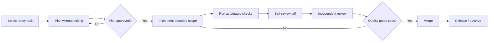

# Vibe Coding Production Kit

> Build with AI like an engineering team — not like a chat session.

[](LICENSE)
[](https://github.com/MoeEyani/vibe-coding-production-kit/stargazers)

**Vibe Coding Production Kit** is a production-minded operating system for AI-assisted software development. It turns vague “vibe coding” into a repeatable engineering workflow built around specifications, architecture, small scoped tasks, tests, security reviews, CI gates, and repository-native AI instructions.

It is model-agnostic and works with tools such as Codex, Claude Code, Cursor, GitHub Copilot, and other coding agents.

> Arabic documentation: [README.ar.md](README.ar.md)

## Bootstrap in 60 seconds

Run the CLI directly from GitHub — no global install required:

```bash
npx --yes github:MoeEyani/Vibe-Coding-Production-Kit init . --agent all
```

Or target another repository:

```bash
npx --yes github:MoeEyani/Vibe-Coding-Production-Kit init ./my-app --agent claude --stack auto --yes
```

The CLI is **zero-runtime-dependency**, refuses to overwrite existing managed files unless you pass `--force`, and can add thin adapters for Claude Code and GitHub Copilot while Codex and Cursor use `AGENTS.md` directly. It also auto-detects TypeScript, Python, and Go projects and fills verification commands only when the repository provides evidence for them. See [`docs/CLI.md`](docs/CLI.md) and [`docs/STACK-PROFILES.md`](docs/STACK-PROFILES.md).

> Planned npm shorthand after the first package release: `npx vibe-coding-production init`

## Audit an existing project

The CLI also includes a read-only doctor that checks whether the engineering system is actually configured—not merely copied:

```bash
npx --yes --package=github:MoeEyani/Vibe-Coding-Production-Kit vibe-coding-production doctor .
```

It reports concrete `PASS / WARN / FAIL` findings for agent instructions, unresolved verification commands, core source-of-truth documents, untouched template markers, CI, and the plan/review loop. Use `--json` for automation or `--strict` to make warnings fail CI. See [`docs/DOCTOR.md`](docs/DOCTOR.md).

## Create a bounded task before coding

Turn a feature into a repository-native task contract:

```bash
npx --yes --package=github:MoeEyani/Vibe-Coding-Production-Kit \
  vibe-coding-production task accept-invite --title "Accept invitation"
```

The generator creates `docs/tasks/accept-invite.md` with source-of-truth links, acceptance criteria, scope boundaries, security questions, failure modes, test plan, rollout/recovery, a plan-before-code section, independent review checklist, and the verification commands actually configured in `AGENTS.md`. See [`docs/TASK-PACKS.md`](docs/TASK-PACKS.md).

## Build the right context for each AI phase

Instead of pasting the whole repository into a coding agent, build a bounded context pack from the task and its authoritative references:

```bash
npx --yes --package=github:MoeEyani/Vibe-Coding-Production-Kit \
  vibe-coding-production context accept-invite --mode plan
```

Use `--mode implement`, `review`, `security`, or `release` as the task progresses. Add only the affected implementation files with repeatable `--include` flags. Context packs reject paths outside the repository and enforce a size budget by default. See [`docs/CONTEXT-PACKS.md`](docs/CONTEXT-PACKS.md).

## Worked reference project

Want to see the workflow as concrete engineering artifacts instead of blank templates? Start with [`examples/reference-saas-invite/`](examples/reference-saas-invite/). It is a security-sensitive multi-tenant invitation vertical slice with a completed product brief, PRD, user flows, domain/data/architecture decisions, ADR, threat model, test strategy, bounded task, layered code, and negative-path tests.

```bash
cd examples/reference-saas-invite
npm test
npm run check
```

The example explicitly documents what remains unproven for real production infrastructure.

## Why this exists

Most AI coding workflows optimize for the first demo. Real software must also survive the 100th feature, the second developer, production incidents, security reviews, migrations, refactors, and years of maintenance.

This kit changes the default loop from:

```text
Prompt -> Generate lots of code -> Hope it works
```

into:

```text
Idea
  -> Product brief
  -> PRD + acceptance criteria
  -> Domain model
  -> Architecture + ADRs
  -> Security + test strategy
  -> Epics / stories / small tasks
  -> Plan before code
  -> Implement bounded scope
  -> Automated verification
  -> Independent review
  -> CI gates
  -> Release + observability
  -> Learn and update the source of truth
```

## Core principle

**Do not ask AI to build your project. Build a system that makes it difficult for AI to build your project incorrectly.**

The human owns intent, trade-offs, architecture, risk acceptance, and final decisions. AI helps research, plan, implement, test, review, document, and automate — inside explicit constraints.

## What you get

- `AGENTS.md` — repository-wide rules for coding agents.
- Product templates — product brief, PRD, user flows, acceptance criteria.
- Architecture templates — domain model, system design, data model, ADRs.
- Security template — lightweight threat modeling before implementation.
- Test strategy — how to decide unit/integration/contract/E2E coverage.
- Delivery system — Definition of Ready, Definition of Done, task and release checklists.
- Agent prompts — discovery, planning, implementation, code review, security review, refactoring, release review.
- GitHub hygiene — issue templates, PR template, contributing guide, security policy.
- CI validation — ensures the framework remains structurally complete.
- English-first README plus an Arabic guide for broader adoption.

## 5-minute start

### 1. Bootstrap the kit

Use the CLI above, or copy the repository manually if you prefer. For a preview before writing anything:

```bash
npx --yes github:MoeEyani/Vibe-Coding-Production-Kit init . --agent all --dry-run
```

### 2. Fill documents in this order

1. `docs/product/PRODUCT-BRIEF.md`
2. `docs/product/PRD.md`
3. `docs/product/USER-FLOWS.md`
4. `docs/architecture/DOMAIN.md`
5. `docs/architecture/ARCHITECTURE.md`
6. `docs/architecture/DATA-MODEL.md`
7. `docs/security/THREAT-MODEL.md`
8. `docs/testing/TEST-STRATEGY.md`

### 3. Customize `AGENTS.md`

Replace generic commands with your real project commands:

```text
install
format
lint
typecheck
unit tests
integration tests
build
E2E
```

### 4. Never implement an unready task

A task must satisfy [`Definition of Ready`](docs/delivery/DEFINITION-OF-READY.md) before code begins.

### 5. Use the agent loop



Use `vcp context <task> --mode <phase>` to assemble bounded context automatically, or use the prompt files directly:

- [`prompts/02-plan-task.md`](prompts/02-plan-task.md)
- [`prompts/03-implement-task.md`](prompts/03-implement-task.md)
- [`prompts/04-code-review.md`](prompts/04-code-review.md)
- [`prompts/05-security-review.md`](prompts/05-security-review.md)

## The operating model

### Phase 0 — Discovery

Define the problem before the solution. Identify users, outcomes, constraints, risks, assumptions, non-goals, and success metrics.

**Gate:** the problem can be explained without naming a framework or architecture.

### Phase 1 — Product specification

Write behavior, not implementation. Every meaningful feature gets acceptance criteria, error states, permissions, and edge cases.

**Gate:** another engineer can tell what “correct” means without asking the original author.

### Phase 2 — Domain and UX

Define the business language, entities, state transitions, invariants, ownership, and user flows.

**Gate:** business rules are explicit and contradictory states have been eliminated.

### Phase 3 — Architecture

Define module boundaries, dependency direction, data ownership, integration contracts, failure modes, and operational constraints. Record important trade-offs as ADRs.

**Gate:** every major component has a clear responsibility and owner of data.

### Phase 4 — Security and testing

Threat-model sensitive flows before implementation. Decide what must be unit-tested, integration-tested, contract-tested, and E2E-tested.

**Gate:** high-risk paths have controls and verification plans.

### Phase 5 — Delivery planning

Break work down:

```text
Epic -> Feature -> Story -> Task -> Pull Request
```

Tasks should be independently understandable, reviewable, testable, and preferably releasable.

### Phase 6 — AI implementation loop

The agent first reads relevant source-of-truth documents and proposes a plan **without editing code**. Only after the scope is understood should implementation begin.

### Phase 7 — Review and CI

Use a fresh context or a separate agent as reviewer. CI — not agent confidence — decides whether mechanical quality gates passed.

### Phase 8 — Release and operations

Deploy through staging when appropriate, verify migrations and rollback, monitor logs/metrics/traces, and capture incidents or design lessons back into the source of truth.

## Repository map

```text
.
├── AGENTS.md
├── README.md
├── README.ar.md
├── CONTRIBUTING.md
├── SECURITY.md
├── docs/
│   ├── 00-START-HERE.md
│   ├── OPERATING-MODEL.md
│   ├── product/
│   ├── architecture/
│   │   └── adr/
│   ├── security/
│   ├── testing/
│   └── delivery/
├── prompts/
├── examples/
├── scripts/
└── .github/
```

## Non-negotiables

1. **Specs before implementation.**
2. **Architecture decisions are recorded, not buried in chat history.**
3. **No large unbounded agent tasks.**
4. **External input is validated at trust boundaries.**
5. **Authorization is server-side and resource-specific.**
6. **Schema changes use reviewed migrations and rollback thinking.**
7. **Tests are added with behavior, not postponed to the end.**
8. **The builder is not the only reviewer.**
9. **CI is the mechanical source of truth.**
10. **Production must be observable and recoverable.**

## Suggested task size

A good agent task normally has:

- one primary outcome,
- a narrow set of affected modules,
- explicit acceptance criteria,
- known tests,
- no unrelated refactor,
- a diff small enough for a human to understand.

If a task requires a long explanation of “and while you're there…”, split it.

## Tool-specific notes

The kit intentionally avoids locking you into one AI vendor. Keep universal rules in `AGENTS.md`, and add tool-specific instruction files only when they provide real value.

Do not duplicate conflicting rules across five agent configuration files. Prefer one source of truth and thin adapters.

## Roadmap

- [x] Context-aware task pack generator
- [x] Phase-specific bounded context pack builder
- [x] Worked reference vertical slice using the full workflow
- [x] Read-only `doctor` audit with human and JSON output
- [x] CLI to bootstrap the kit into a repository
- [x] Evidence-based stack profiles for TypeScript, Python, and Go
- [ ] Mobile stack profiles
- [ ] CI adapters for common monorepos
- [ ] Security checklists mapped to common application classes
- [ ] Prompt evaluation suite for coding agents
- [ ] Architecture fitness-function examples

See [`CONTRIBUTING.md`](CONTRIBUTING.md) if you want to help.

## License

MIT — use it in personal, commercial, and open-source projects.
