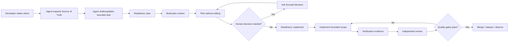

# Vibe Coding Production Kit

> Build with AI like an engineering team — not like a chat session.

[](https://www.npmjs.com/package/vibe-coding-production)
[](LICENSE)
[](https://github.com/Moeeryani/Vibe-Coding-Production-Kit/stargazers)

**Vibe Coding Production Kit (VCP)** is a production-minded operating system and zero-runtime-dependency CLI for AI-assisted software development. It turns vague “vibe coding” into a repeatable engineering lifecycle built around specifications, architecture, bounded tasks, repository-native agent rules, readiness gates, security, verification evidence, independent review, safe updates, and recovery.

It is model-agnostic and works with tools such as Codex, Claude Code, Cursor, GitHub Copilot, and other coding agents.

> Arabic documentation: [README.ar.md](README.ar.md)

## Start in 60 seconds

Run the published npm package directly — no global install required:

```bash
npx vibe-coding-production init . --agent all --stack auto --yes
```

Or target another repository:

```bash
npx vibe-coding-production init ./my-app --agent claude --stack auto --yes
```

Preview without writing:

```bash
npx vibe-coding-production init . --agent all --stack auto --dry-run
```

The executable is also available as `vcp` when installed or invoked through npm package tooling.

If you intentionally want to run the repository version instead of the published npm package:

```bash
npx --yes github:Moeeryani/Vibe-Coding-Production-Kit init . --agent all --stack auto --yes
```

The CLI requires **Node.js 22+**, has **no runtime dependencies**, and auto-detects JavaScript/Node.js, TypeScript, Python, and Go only when repository evidence supports that decision.

**New here?** Follow the end-to-end [`10-minute Quickstart`](docs/QUICKSTART.md).

## Use VCP through your coding agent

VCP is intended to be driven primarily by the coding agent rather than by a developer manually filling every template or memorizing every command.

After initialization, you can tell Claude Code, Codex, Cursor, or another compatible agent:

```text
Set up VCP for this repository. Inspect the existing code, package scripts, tests,
architecture, and documentation. Draft the VCP source-of-truth files from repository
evidence. Distinguish discovered facts from proposed decisions, and ask me only for
decisions that require human product or engineering intent. Run VCP Doctor when done.
```

For feature work, state the intent normally:

```text
Use VCP and add verified email change. Draft the task, run the readiness gates,
ask me only for unresolved product decisions, plan before coding, verify the result,
and perform an independent review.
```

The desired split is simple:

```text
AI does the inspection, drafting, bookkeeping, and VCP command execution.
Human makes product/engineering decisions and approves important trade-offs.
VCP preserves the decisions, gates implementation, and records verification evidence.
```

## Why this is different

Most vibe-coding workflows optimize for getting the first demo working. VCP optimizes for the 100th feature, the second developer, production incidents, security reviews, migrations, refactors, upgrades, and years of maintenance.

| Casual vibe coding | Vibe Coding Production Kit |
| --- | --- |
| Prompt is the source of truth | Repository docs are the source of truth |
| Large “build this app” requests | Small bounded task contracts |
| Agent starts coding immediately | Readiness + plan-before-code gates |
| “Tests should pass” | Executed verification evidence |
| Same agent builds and judges | Independent review workflow |
| Copy templates once | Versioned lifecycle state + safe updates |
| Overwrite/reinstall to upgrade | Baselines, merge, migrations, rollback |
| Hope production is okay | Security, observability, release/recovery thinking |

## The daily workflow

What the developer should experience:

```text
state intent
  ↓
answer only unresolved human decisions
  ↓
review / approve plan
  ↓
review final result + evidence
```

What the coding agent executes behind that experience:

```text
init / inspect
  ↓
task
  ↓
ready --stage plan
  ↓
context --mode plan
  ↓
plan
  ↓
ready --stage implement
  ↓
context --mode implement
  ↓
implement
  ↓
verify
  ↓
independent review
  ↓
doctor
  ↓
release / observe
```

When a newer VCP version is available:

```text
update --check
  ↓
update --dry-run
  ↓
resolve conflicts if any
  ↓
update
  ↓
doctor
```

## Safe lifecycle updates — v0.9

`vcp init` now creates `.vcp/manifest.json` and persistent baseline snapshots. Once a repository is initialized, VCP refuses to replace that lifecycle state with `init --force`; upgrades go through the update engine.

Check version state:

```bash
vcp update . --check
vcp update . --check --json
```

Preview the full migration plan without writing project files:

```bash
vcp update . --dry-run
```

Apply after reviewing the plan:

```bash
vcp update .
```

Recover the newest safe recovery point:

```bash
vcp rollback .
```

Detach or re-track one VCP-managed file without deleting local content:

```bash
vcp manage ignore AGENTS.md
vcp manage track AGENTS.md
```

The update engine uses:

- persistent baseline hashes and snapshots;
- `managed`, `generated`, and `preserve` ownership policies;
- bounded three-way merge for independent edits;
- explicit `CONFLICT` instead of guessing on overlaps;
- versioned migration declarations for renames/removals;
- lifecycle locking before planning and mutation;
- path traversal and symlink protections;
- transaction state, backups, post-apply verification, and automatic rollback;
- conservative rollback semantics instead of pretending partial historical backups are complete snapshots.

See [`docs/UPDATES.md`](docs/UPDATES.md) for the full contract and [`docs/CLI.md`](docs/CLI.md) for commands/options.

## Audit an existing project

The read-only doctor checks whether the engineering system is actually configured—not merely copied:

```bash
npx vibe-coding-production doctor .
```

It reports concrete `PASS / WARN / FAIL` findings for agent instructions, unresolved verification commands, source-of-truth documents, untouched templates, CI, plan/review workflow, manifest compatibility, baseline integrity, and interrupted update transactions.

Use `--json` for automation or `--strict` to make warnings non-zero. See [`docs/DOCTOR.md`](docs/DOCTOR.md).

## Create a bounded task before coding

```bash
npx vibe-coding-production task accept-invite --title "Accept invitation"
```

The generator creates `docs/tasks/accept-invite.md` with source-of-truth links, acceptance criteria, scope boundaries, security/privacy questions, failure modes, observability, tests, rollout/recovery, implementation planning, review checks, and the verification commands actually configured in `AGENTS.md`.

The coding agent should draft and update this task from repository evidence instead of asking the developer to fill every field manually.

See [`docs/TASK-PACKS.md`](docs/TASK-PACKS.md).

## Gate readiness before planning and implementation

```bash
vcp ready accept-invite --stage plan
vcp ready accept-invite --stage implement
```

The planning gate requires a real outcome, resolvable Source of Truth, concrete acceptance criteria, explicit scope, and an unambiguous task structure. The implementation gate additionally requires resolved architecture/data/integration boundaries, domain invariants, security/privacy, failure modes, observability, testing, rollout/recovery, a concrete implementation plan, and an executable verification plan.

Referenced Source of Truth files that still contain known starter-template signals are reported as warnings so the agent can draft project-specific decisions instead of treating an empty template as evidence.

See [`docs/TASK-READINESS.md`](docs/TASK-READINESS.md).

## Build the right context for each AI phase

```bash
vcp context accept-invite --mode plan
```

Use `--mode implement`, `review`, `security`, or `release` as the task progresses. Add only affected implementation files with repeatable `--include` flags. Context packs reject repository escapes and enforce a size budget by default.

See [`docs/CONTEXT-PACKS.md`](docs/CONTEXT-PACKS.md).

## Turn “I ran the tests” into evidence

Preview exactly what would execute:

```bash
vcp verify accept-invite
```

Execution requires explicit consent and an implementation-ready task:

```bash
vcp verify accept-invite --run \
  --output .vcp/evidence/accept-invite.json
```

Commands run sequentially and stop after the first failure. Evidence records command, status, exit code, signal, timeout state, and duration, while raw stdout/stderr is deliberately not persisted by default.

See [`docs/VERIFICATION-EVIDENCE.md`](docs/VERIFICATION-EVIDENCE.md).

## Worked reference project

Start with [`examples/reference-saas-invite/`](examples/reference-saas-invite/) to see the workflow as concrete engineering artifacts instead of blank templates.

It models a security-sensitive multi-tenant invitation vertical slice with completed product/domain/architecture/data artifacts, ADR, threat model, test strategy, bounded task, layered code, and negative-path tests for authorization, tenant boundaries, token hashing, expiry, replay, and email binding.

```bash
cd examples/reference-saas-invite
npm test
npm run check
```

The example explicitly documents what remains unproven for real production infrastructure instead of calling a demo “production-ready.”

## Core principle

**Do not ask AI to build your project. Build a system that makes it difficult for AI to build your project incorrectly.**

The human owns intent, trade-offs, architecture, risk acceptance, and final decisions. AI helps inspect, draft, research, plan, implement, test, review, document, and automate — inside explicit constraints.

## The lifecycle

```text
Idea
  -> Product brief
  -> PRD + acceptance criteria
  -> User flows
  -> Domain model
  -> Architecture + ADRs
  -> Data model
  -> Threat model
  -> Test strategy
  -> Epics / stories / bounded tasks
  -> Readiness gate
  -> Plan before code
  -> Bounded implementation
  -> Verification evidence
  -> Independent review
  -> CI gates
  -> Release + observability
  -> Safe VCP lifecycle updates
  -> Learn and update the source of truth
```

## What you get

- `AGENTS.md` — repository-wide rules and an AI-first VCP operating protocol for coding agents.
- Product templates — product brief, PRD, user flows, acceptance criteria.
- Architecture templates — domain model, system design, data model, ADRs.
- Security template — threat modeling before implementation.
- Test strategy — unit/integration/contract/E2E decision framework.
- Delivery system — Definition of Ready, Definition of Done, task/release checklists.
- `vcp task` — bounded repository-native task contracts.
- `vcp ready` — separate plan/implementation readiness gates.
- `vcp context` — bounded phase-specific AI context packs.
- `vcp verify` — explicit execution and verification evidence.
- `vcp doctor` — repository/system health audit without a misleading magic score.
- `vcp update` — lifecycle-aware safe updates with merge/migrations/recovery.
- Agent prompts — discovery, planning, implementation, review, security, refactoring, release review.
- GitHub hygiene — issue templates, PR template, contributing guide, security policy, validation workflow.
- English README plus an Arabic guide.

## Establish the source of truth

These are the main project documents VCP manages:

1. `docs/product/PRODUCT-BRIEF.md`
2. `docs/product/PRD.md`
3. `docs/product/USER-FLOWS.md`
4. `docs/architecture/DOMAIN.md`
5. `docs/architecture/ARCHITECTURE.md`
6. `docs/architecture/DATA-MODEL.md`
7. `docs/security/THREAT-MODEL.md`
8. `docs/testing/TEST-STRATEGY.md`

Do **not** treat this as a manual form-filling checklist. Have the coding agent inspect repository evidence and draft these files. The developer should approve or correct decisions that require human intent. `AGENTS.md` should likewise be populated from proven repository commands where possible; unresolved commands stay explicit instead of being guessed.

## Agent execution loop



## Repository map

```text
.
├── AGENTS.md
├── README.md
├── README.ar.md
├── CONTRIBUTING.md
├── SECURITY.md
├── bin/
├── lib/
├── docs/
│   ├── 00-START-HERE.md
│   ├── QUICKSTART.md
│   ├── CLI.md
│   ├── UPDATES.md
│   ├── product/
│   ├── architecture/
│   ├── security/
│   ├── testing/
│   └── delivery/
├── prompts/
├── examples/
├── scripts/
└── .github/
```

## Non-negotiables

1. **Specs before implementation.**
2. **Architecture decisions are recorded, not buried in chat history.**
3. **No large unbounded agent tasks.**
4. **External input is validated at trust boundaries.**
5. **Authorization is server-side and resource-specific.**
6. **Schema changes use reviewed migrations and rollback thinking.**
7. **Tests are added with behavior, not postponed to the end.**
8. **The builder is not the only reviewer.**
9. **CI is the mechanical source of truth when CI is available.**
10. **Production must be observable and recoverable.**
11. **Lifecycle upgrades are planned and reversible; templates are not blindly recopied.**
12. **Do not make the developer write information the agent can reliably discover or draft.**

## Suggested task size

A good agent task normally has:

- one primary outcome;
- a narrow set of affected modules;
- explicit acceptance criteria;
- known tests;
- no unrelated refactor;
- a diff small enough for a human to understand.

If a task requires a long explanation of “and while you're there…”, split it.

## Tool-specific notes

The kit intentionally avoids locking you into one AI vendor. Keep universal rules in `AGENTS.md`, and add tool-specific instruction files only when they provide real value.

Do not duplicate conflicting rules across multiple agent configuration files. Prefer one source of truth and thin adapters.

## Roadmap

- [x] CLI bootstrap with evidence-based JavaScript/TypeScript/Python/Go profiles
- [x] Context-aware task pack generator
- [x] Two-stage task readiness gate
- [x] Phase-specific bounded context packs
- [x] Safe verification evidence workflow
- [x] Read-only `doctor` audit
- [x] Worked reference vertical slice
- [x] Versioned lifecycle state and safe `vcp update`
- [x] Three-way merge, migrations, locking, backup, rollback, and manage ignore/track
- [ ] Mobile stack profiles
- [ ] Monorepo-aware stack/CI profiles
- [ ] Security profiles for common application classes
- [ ] Git-aware review/release automation
- [ ] Prompt evaluation suite for coding agents
- [ ] Architecture fitness-function examples
- [ ] Extensible community profile/plugin system

See [`CONTRIBUTING.md`](CONTRIBUTING.md) if you want to help.

## License

MIT — use it in personal, commercial, and open-source projects.
