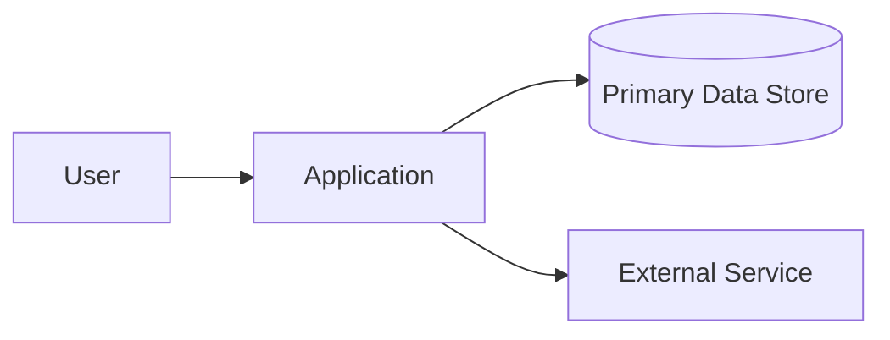

# Architecture

## Architecture goals
List the qualities the architecture must optimize for: maintainability, delivery speed, isolation, latency, reliability, cost, portability, compliance, etc.

## Constraints
-

## System context


## High-level components
| Component | Responsibility | Owns data? | Public contract |
|---|---|---|---|
| | | | |

## Dependency rules
Document allowed dependency direction and forbidden coupling.

Example:
```text
Presentation -> Application -> Domain
Infrastructure implements ports owned by inner layers
```

## Module boundaries
For each module describe:
- responsibilities;
- public interface;
- private internals;
- owned tables/data;
- emitted/consumed events;
- forbidden dependencies.

## API strategy
- style/protocol:
- versioning:
- idempotency:
- pagination:
- errors:
- authn/authz:

## Async/event strategy
- broker/queue if any:
- ordering requirements:
- delivery semantics:
- retries/dead-letter handling:
- idempotent consumers:

## Caching
What may be cached, invalidation rules, stale-data tolerance.

## Failure model
List important dependencies and behavior when each is slow, unavailable, or returns invalid data.

## Deployment topology
-

## Scalability assumptions
Do not design for imaginary scale. State expected load and thresholds that would trigger redesign.

## Observability
- logging:
- metrics:
- tracing:
- audit:
- SLOs/alerts:

## Architecture fitness checks
List automated checks that protect architectural boundaries when possible.

## Accepted ADRs
Link important decisions from `docs/architecture/adr/`.
