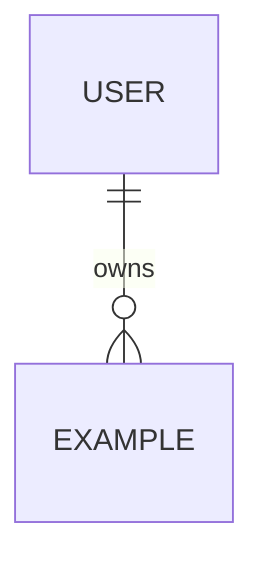

# Data Model

## Data ownership
| Data set / table | Owning module | Source of truth | Sensitivity | Retention |
|---|---|---|---|---|
| | | | | |

## Entity relationships

## Schema notes
For each important table/entity document:
- primary identity;
- natural/business keys;
- tenant ownership;
- uniqueness constraints;
- foreign keys;
- indexes tied to query patterns;
- lifecycle/soft delete rules;
- timestamps/timezone rules;
- sensitive fields;
- encryption requirements.

## Consistency and transactions
Which invariants require atomic updates? What can be eventually consistent?

## Migration strategy
- additive-first changes where practical;
- backward compatibility during rolling deploys;
- backfill approach;
- destructive-change procedure;
- rollback/recovery plan.

## Data deletion/export
Document privacy/compliance behavior if applicable.
