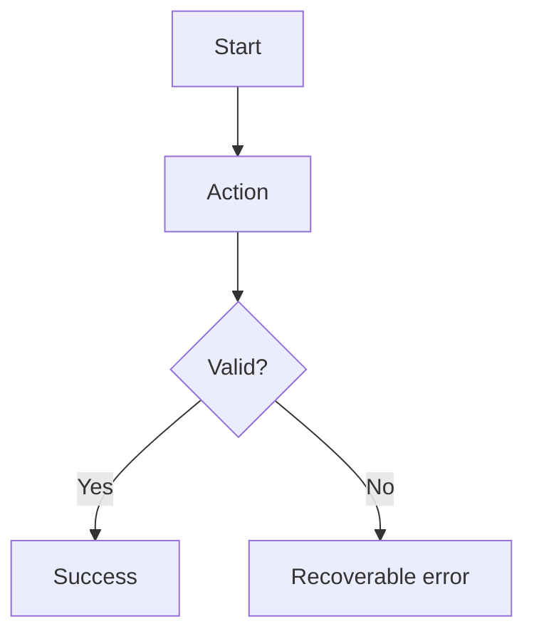

# User Flows

For every critical journey document not only the happy path, but also loading, empty, partial, validation, permission, timeout, retry, offline (if relevant), and unexpected-error states.

## Flow: <name>

**Actor:**

**Entry points:**

**Preconditions:**

### Screen/state inventory
| State | What user sees | Allowed actions | Backend dependency |
|---|---|---|---|
| Loading | | | |
| Empty | | | |
| Ready | | | |
| Validation error | | | |
| Forbidden | | | |
| Failure | | | |
| Success | | | |

### Edge cases
-

### Accessibility notes
-

### Analytics/audit events
-
