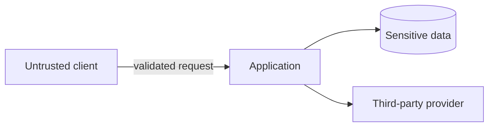

# Threat Model

This template is intentionally lightweight. Increase rigor for sensitive/high-risk systems.

## Scope
What feature/system/release is covered?

## Assets to protect
| Asset | Why valuable/sensitive | Owner |
|---|---|---|
| | | |

## Actors
- anonymous user
- authenticated user
- privileged/admin user
- malicious user
- compromised account
- internal operator
- third-party integration

Add project-specific actors.

## Trust boundaries
Identify transitions such as:
- browser -> API;
- service -> database;
- service -> external provider;
- tenant A -> shared infrastructure;
- public network -> private network;
- CI -> production credentials.

## Data flows

## Threat inventory
| ID | Threat | Entry point | Impact | Likelihood | Controls | Verification | Residual risk |
|---|---|---|---|---|---|---|---|
| T-001 | | | | | | | |

## Checklist prompts
Consider where relevant:
- authentication bypass;
- broken access control / IDOR;
- tenant isolation failure;
- injection;
- XSS / CSRF;
- SSRF;
- unsafe redirects;
- secret leakage;
- insecure file upload;
- replay/idempotency abuse;
- brute force/rate abuse;
- privilege escalation;
- dependency/supply-chain risk;
- sensitive logging;
- data retention/deletion failures;
- insecure defaults;
- race conditions affecting money/permissions/inventory.

## Security test requirements
List negative-path automated tests and any manual/pentest checks required.

## Accepted risks
Risk acceptance must identify an owner and reason; do not silently leave known threats unaddressed.
